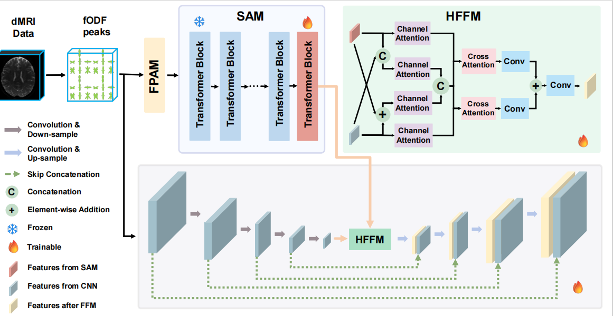

# SC2S-Net: When Segment Anything Model Meets Corpus Callosum Segmentation

## 1. Abstract
Accurate segmentation of the corpus callosum (CC) is crucial for the quantitative analysis of neurological disorders related to brain whiter matter. While deep learning has enabled automated CC segmentation with diffusion MRI data, existing methods struggle to capture fiber information over long distances. Segment anything model (SAM) offers some promise but its adaptability to dMRI data remains unexplored due to the existence of data modality gaps. To this end, we propose a SAM-driven CC segmentation network (SC2S-Net), which synergizes SAM's global context modeling with dMRI-derived fiber orientation distribution function (fODF) peaks to achieve CC segmentation. Our key innovations include: (1) a fiber peak adaption module aligning fODF peak maps with the encoder of SAM via semantic space mapping; (2) a dual-branch architecture combining SAM's global attention with local fiber feature learning based on the convolutional neural network; and (3) a hybrid feature fusion module integrating complementary representations for fine-grained segmentation. We evaluated SC2S-Net on the human connectome project dataset, achieving the best performance with a 3.8% Dice score improvement and a 2.06 mm reduction in 95% Hausdorff distance over the cutting-edge method.

## 2. Method Overview


## 3. Training Procedure
### 3.0 Setting Environments
Create and activate conda environment named SC2SNet from requirements.txt.
```
conda create -n SC2S-Net python=3.10
pip install -r requirements.txt
conda activate SC2S-Net
```
### 3.1 Datasets
Users can download the dataset used in this project in the following locations:
https://drive.google.com/file/d/1hFWFEnUb4IjtstZVT5HF8R1hyzxsi6E7/view?usp=sharing
### 3.2 Training
#### Preparing
First, you should confirm the training configuration in /SC2S-Net/tractseg/experiments/base.py.
#### Training Model
After entering the SC2S-Net folder, you can run
```
python SC2S-Net/bin/ExpRunner.py
```
to train the model by youself. After training, model checkpoints and experimental results will be saved in the path set by the user.

## Acknowledgements
The authors have no conflict of interest to declare.

## Citation
Please cite our paper if the code should be useful for you.